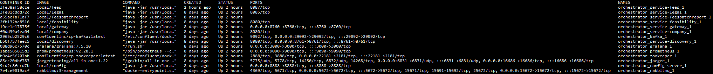
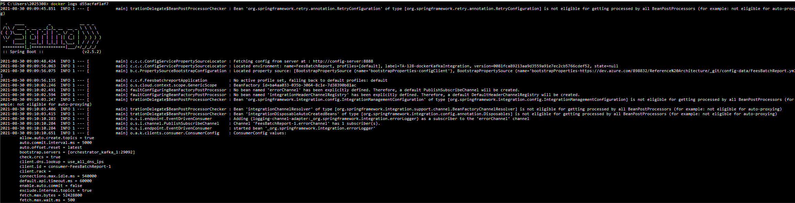

# DOCKER TUTORIAL

## INTRODUCTION
This guide includes a walkthrough of how to run Reference-Architecture microservices as Docker containers.

## BUILD DOCKER IMAGES
Each microservice project should contain a **Dockerfile** with the information of how to execute the _jar_ inside Docker. The _jar_ must be compiled and present in _target/_ folder

To build the Docker image is needed to specify the correct image name included in **docker-compose** file

The images needed to run the full platform in Docker are:

| Microservice | Image name |
|--|--|
| config-server | local/config |
| service-discovery | local/discovery |
| mortgage-feasibility-validator | local/feasibility |
| company-management | local/company |
| api-gateway | local/gateway |
| fees-module | local/fees |
| fees-batch-report | local/feesbatchreport |
| legal-system | local/legal |

Example of how to build the image manually:

In mortgage-feasibility-validator main folder (where Dockerfile must be present), execute next command:

`docker image build -t local/feasibility:latest .`

## DOCKER COMPOSE
When all images are built, it is time to run the containers. Using docker-compose command is possible to run all the microservices at the same time, and establish a connectivity so they can see each other. The configuration of each microservice is included in the orchestrator module inside **docker-compose.yml** file.

To run the platform, in the orchestrator folder, execute next command:

`docker-compose up --build`

The containers will be created and the services will start to run. With the command `docker ps` you should see the following containers running:



**IMPORTANT: To run the environment properly is needed to increase the memory asigned of Docker Desktop:**

Docker Desktop -> Settings -> Resources -> Advanced -> Memory: 4 GB

## CONFIGURATION
To reach a service from other service inside Docker, is mandatory to use the container name as host. In the config-data repository, the default profiles must include container names in order to run properly in Docker.

For example, the correct configuration of Kafka bootstrap server of default profile is the next:

```
spring:
  application:
    name: FeesModule
  kafka:
    bootstrap-servers: orchestrator_kafka_1:29092
```

To run the service outside docker, this configuration won't work. For this purpose, the local profile has been created, overriding the configuration and including localhost:


```
spring:
  kafka:
    bootstrap-servers: localhost:9092
```

Note: It is possible to run the Kafka servers with Docker and reach them outside Docker with local profile.

## Docker management

To see the logs of some service, get the _containerID_ with _ps_ command and execute the command `docker logs [containerID]`

Example:


 
It is possible to execute Kafka commands inside Kafka container with next command:
`docker exec -it [orchestrator_kafka_1_ID] bash`

To see the content of a Kafka topic, execute next command:
`/BIN/kafka-console-consumer --bootstrap-server localhost:9092 --from-beginning --topic [KAFKA_TOPIC]`

Topics used by Reference Architecture:
- FEES_EVENTS
- MORTGAGE_EVENTS

For Rabbit server, follow the same process and execute the _Rabbit_ command needed. 
Example:
`rabbitmqadmin list queues`

## Test
To test the full flow, follow the tutorial of Onboarding page and see the logs of the different microservices.

https://dev.azure.com/898832/Reference%20Architecture/_wiki/wikis/Reference-Architecture.wiki/16/Onboarding